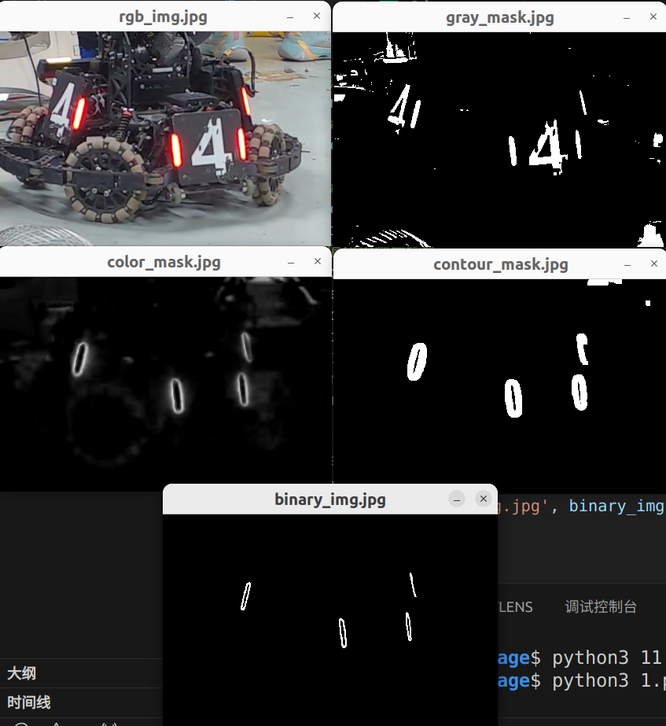

# armor_detector

装甲板识别和数字检测

## detector_node

识别节点

订阅相机内参和原始图片，通过相机内参初始化 `pnp_solver`，创建识别器 `detector`，将图片送入识别器获取装甲板，再将装甲板送入 pnp 解算器，获取并发布其三维坐标

订阅：
- 相机内参 `/camera_info`
- 原始图片 `/image_for_armor`

发布：
- 识别到的装甲板 `/detector/armors`

## detector

识别器

通过 `预处理 -> 检测灯条 -> 匹配灯条 -> 数字识别` 输出图片中合法装甲板的二维信息

### 预处理

1. 转为灰度图

2. 二值化，两种方法可选
    1. 使用 `cv::threshold` 通过固定阈值进行二值化
    2. 使用通道相减（可避免检测灯条中的颜色判断）
        1. 使用 `cv::threshold` 通过固定阈值进行二值化，找出图片中较亮的区域 `gray_mask`
        2. `敌方颜色通道 - 己方颜色通道` 获得敌方装甲板的轮廓 `color_mask`。装甲板灯条中心较亮（显示为白色，三通道几乎都为 255），通道相减后几乎为 0，而灯条边缘颜色正常，敌方颜色通道数值大，己方颜色通道数值小，相减几乎不变。
        3. 对`color_mask`进行二值化后膨胀，扩展轮廓，得到`contour_mask`
        4. `gray_mask` 和 `contour_mask` 按位与，获得敌方装甲板灯条轮廓图
        5. 过程效果图：

### 检测灯条

1. `cv::findContours` 寻找轮廓
2. 遍历轮廓，寻找灯条并判断颜色
   - 通过灯条长宽比，倾斜角判断是否为合法灯条

### 匹配灯条

两层循环遍历所有灯条，一一匹配

1. 是否为己方
2. 两灯条之间是否包含其他灯条
3. 两灯条形成的装甲板是否合法
    - 两灯条长度比
    - 灯条中心距离（归一化，装甲板长度）
    - 装甲板水平倾斜角度
    - 判断装甲板类型

## pnp_solver

采用 IPPE 方法，并将第一次解算结果再次带入进行二次迭代
