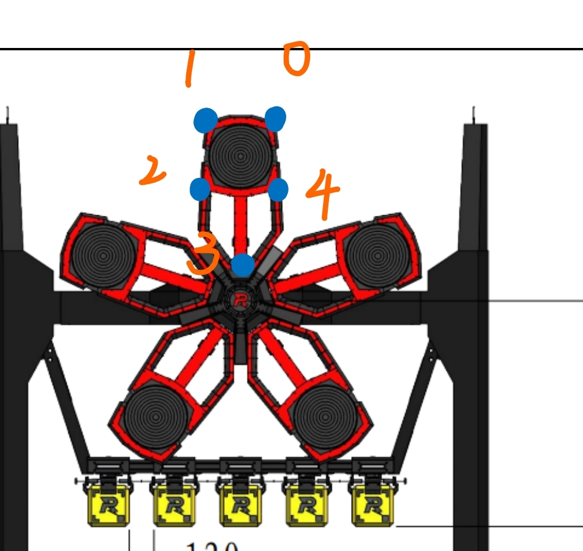
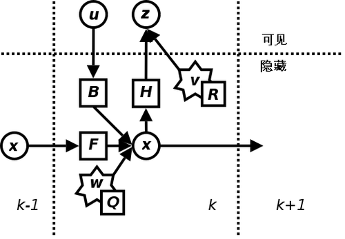

# rune_auto_aim
- [rune\_auto\_aim](#rune_auto_aim)
  - [Brief](#brief)
  - [rune\_detector](#rune_detector)
  - [rune\_tracker](#rune_tracker)
    - [UKF无迹卡尔曼滤波器](#ukf无迹卡尔曼滤波器)
    - [Ceres-solver](#ceres-solver)
  
## Brief
```
 .
 ├──rune_detector
 ├──rune_shooter
 └──rune_tracker
 ```
 能量机关角速度函数:
$$  w = A * cos (\omega * t + \phi) + b  $$

## rune_detector
能量机关识别，基于神经网络**yolox**的五点框目标检测网络，使用**openvino**加速在小电脑上用核显加速推理

网络输出结果为未激活符叶、已激活符叶、R标的五点像素坐标和概率，随后将输出的点输入pnp_solver进行解算输出旋转、平移向量

订阅：
- 接收相机节点的图片 `/image_for_rune`

发布：
- 最终解算出来的数据发布 `/detector/runes`

参数：
- 神经网络参数
  - 置信度阈值 confidence_threshold

- 神经网络训练仓库传送门
[沈航开源网络](https://github.com/tup-robomaster/TUP-NN-Train-2)
  - [上交训练集标注转换工具](https://github.com/Spphire/RM-labeling-tool)
  (上交转换工具还需要自己修改一下部分细节)
- 符叶和R标的标注点顺序如下图


## rune_tracker
能量机关追踪模块,主要通过前面的检测模块采集角速度数据，然后将其送入ukf滤波器进行滤波处理,随后将平滑的角速度曲线送入ceres求解器

输出能量机关旋转角速度三角函数参数(幅值、相位、角频率、上下位移)

### UKF无迹卡尔曼滤波器
- [无迹卡尔曼传送口](https://github.com/saishiva024/LIDAR-RADAR-Fusion-UKF/blob/master/src/ukf.cpp)
- [ukf公式](https://zhuanlan.zhihu.com/p/359811364)



### Ceres-solver
本项目使用最小二乘法拟合去求解三角函数参数
- [ceres-solver's github](https://github.com/ceres-solver/ceres-solver)
- [最小二乘法传送口](https://zhuanlan.zhihu.com/p/38128785)
